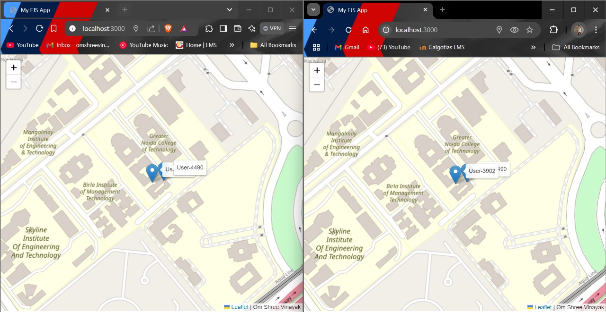

# RealTimeLocator



## Introduction

**RealTimeLocator** is a real-time tracking application built with  ,  ,  , and  . This project demonstrates the ability to track multiple users' locations in real-time, display markers on a map, and provide live notifications for user connections and disconnections.

## 🚀 Features

- **Real-Time Location Tracking:** Track multiple  in real-time with high accuracy.
- **User Notifications:** Receive notifications when users connect or disconnect 
.
- **Persistent User IDs:** Unique user IDs are maintained across sessions using local storage.
- **Interactive Map:** View and interact with user markers on a map, with real-time updates.

## 🛠️ Installation

1. Clone the repository:
   ```sh
   git clone https://github.com/omshreevinayak/Real_Time_Tracker.git
